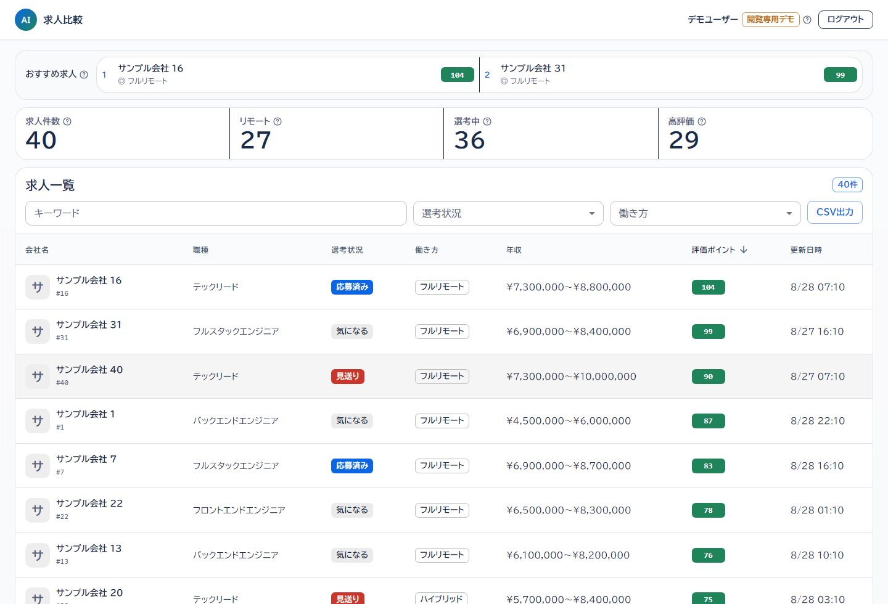
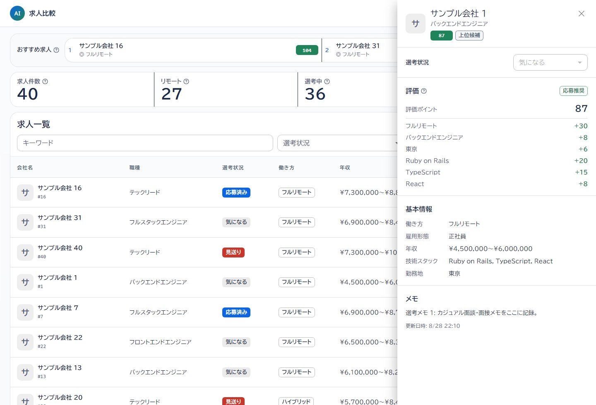
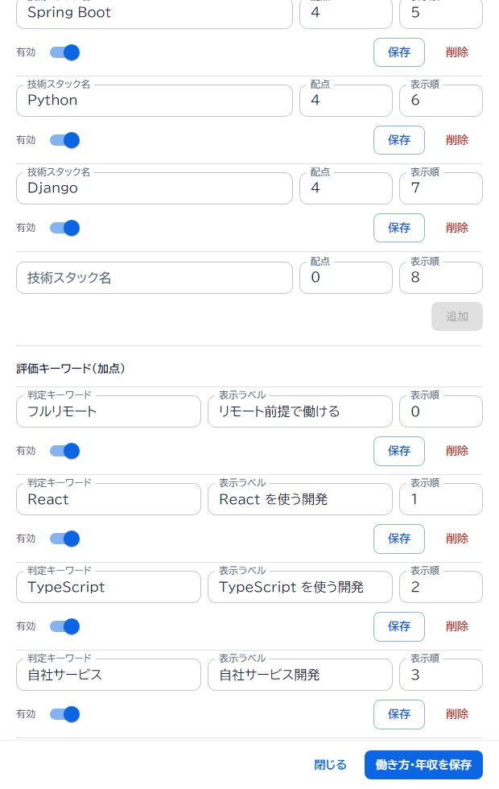

# AI求人診断ダッシュボード

[](https://github.com/naoki-webdev/job/actions/workflows/ci.yml)

[公開デモ](https://job-compare-dashboard.onrender.com/) · [GitHub](https://github.com/naoki-webdev/job)

求人票本文を貼り付けると、会社名・年収・勤務地・技術スタックを整理し、ユーザーごとの評価条件で応募先を比較できる求人ダッシュボードです。

Rails API + React / TypeScriptで構築し、求人管理、検索・絞り込み、CSV出力、スコアリング、AI・ルールベースによる求人票抽出を実装しています。

公開デモは閲覧専用です。検索・絞り込み・CSV出力・詳細表示を試せます。

- メールアドレス `demo@example.com`
- パスワード `password`

## なぜ作ったか

転職活動で見比べたい求人が増えると、スプレッドシートに並べるだけでは優先順位をつけづらくなりました。技術スタック、働き方、年収、選考状況を自分の条件で重み付けして比較したくて作りました。

## 主な機能

- 求人の作成・編集・削除、検索、絞り込み、ソート、ページネーション、CSV出力
- 働き方・年収・職種・勤務地・技術スタックを使ったユーザー別スコアリング
- 求人票本文の情報整理と、加点・減点・面接で確認する項目の提示
- ルールベース抽出とGemini 2.5 FlashによるAI抽出（AI利用を許可したユーザーのみ）
- 検索条件に連動するサマリーと上位求人の表示
- 会社ロゴ画像のアップロードと、求人・スコア設定の操作ログ

## 画面

### ログイン


### 求人一覧



### 求人詳細



### 求人本文から取り込み


求人URLは参照元として保存し、本文は貼り付けて分析します。URLの自動取得は行いません。

### スコア設定



## 技術構成

- Backend: Ruby 3.3 / Ruby on Rails 8（API mode）
- Frontend: React 19 / TypeScript 5.8 / Vite 6 / MUI 7
- Database: PostgreSQL 16
- Auth: `has_secure_password` / DB-backed session / HttpOnly Cookie
- Storage: Active Storage（本番はS3互換ストレージ）
- Infra: Docker Compose（ローカル）、Render + Supabase PostgreSQL（本番）
- Test: Minitest / Vitest / Playwright
- CI: GitHub Actions（Brakeman、RuboCop、Rails test、frontend lint / test / build、Playwright E2E）

## 設計

- `JobsQuery` に検索・絞り込み・ソートを集約し、一覧・CSV・サマリーで同じ条件を使う
- 検索は `JobsQuery`、JSONは `JobSerializer`、CSVは `JobsCsvExport` に分ける
- すべての求人・評価マスタを `current_user` 起点で扱い、モデルでも関連マスタの所有者を検証する
- DBセッションをHttpOnly Cookieで管理し、ログアウト時はサーバー側のセッションも削除する
- AI出力はユーザー登録済みのマスタと照合し、未登録の判定理由をレスポンスへ含めない

詳しい設計とAPIの扱いは [アーキテクチャ](docs/ARCHITECTURE.md) を参照してください。

## セットアップ

```bash
make setup
make up
```

フロントエンドは `http://127.0.0.1:5173` で起動します。環境変数と本番デプロイの手順は [デプロイメントガイド](docs/DEPLOYMENT.md) を参照してください。

## テスト

```bash
docker compose exec -T web bin/rails test
make test-frontend
make e2e
make verify
```

Railsのintegration test、Vitest、Playwright E2EをGitHub Actionsで実行します。
